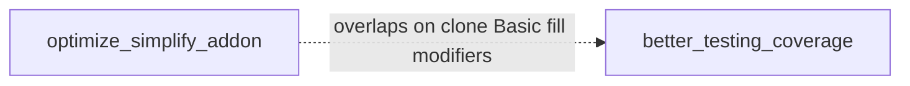
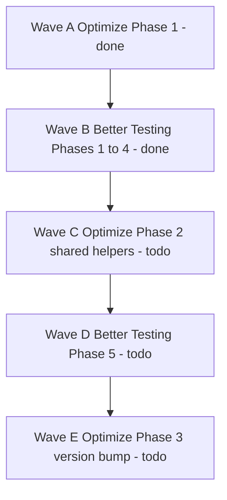
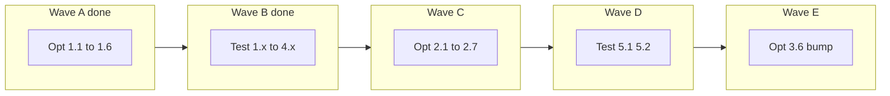

# Global roadmap

One place to see all plans and the suggested order to execute them. Detail lives in the linked plans; update status here when a **wave** finishes.

**Status legend:** ✅ done · 🚧 in_progress · ⏳ todo

## Plans index

| Status | Plan | File | Goal |
|--------|------|------|------|
| 🚧 | Optimize & simplify | [optimize_simplify_addon.md](optimize_simplify_addon.md) | API-stable dedupe, correctness, docs/tests |
| 🚧 | Better testing coverage | [better_testing_coverage.md](better_testing_coverage.md) | GdUnit4 gaps: Health, HitScan, Basic, resources, integration |

---

## Suggested execution order

Do work in **waves**. Waves A→B lock behavior before the big refactor in C.

| Status | Wave | Do this | From plan | Why this order |
|--------|------|---------|-----------|----------------|
| ✅ | **A** | Phase 1 correctness: HitScan clone, Basic init clear+set, deep `HealthModifiedAction.clone()`, Health `verbose_debug` / enum NONE / `old_max` | [optimize](optimize_simplify_addon.md) § Phase 1 | Fix behavior first so new tests assert the right thing |
| ✅ | **B** | Phases 1–4: `fill`/modifiers, HitScan clone + Basic init tests, resource clones, HurtBox/Health edges | [testing](better_testing_coverage.md) § 1–4 | Locks Wave A; also satisfies optimize § 3.2–3.5 |
| ⏳ | **C** | Phase 2: `shared/` helpers, thin 2D/3D wrappers, data-driven `plugin.gd` | [optimize](optimize_simplify_addon.md) § Phase 2 | Refactor with tests as safety net |
| ⏳ | **D** | Phase 5: real HitBox/HitScan → HurtBox → Health | [testing](better_testing_coverage.md) § 5 | Confirms pipeline after refactor |
| ⏳ | **E** | Version bump to `5.0.5` (README v5 overview already shipped) | [optimize](optimize_simplify_addon.md) § 3.1 done / 3.6 | Ship when A–D are green |

---

## Overlaps (do once)

These items appear in both plans. Implement in Wave A (code) + Wave B (tests); skip duplicate work in optimize Phase 3.

| Status | Topic | Optimize task | Testing task | Do in |
|--------|-------|---------------|--------------|-------|
| ✅ | HitScan clones actions (code) | 1.1 | — | A |
| ✅ | HitScan clones (tests) | 3.2 | 2.1 | B |
| ✅ | Basic init clear+set (code) | 1.2 | — | A |
| ✅ | Basic init (tests) | 3.3 | 2.2 / 2.3 | B |
| ✅ | Deep `HealthModifiedAction.clone` (code) | 1.3 | — | A |
| ✅ | Deep clone (tests) | 3.4 | 3.3 | B |
| ✅ | `fill` + Health modifiers | 3.5 | 1.1–1.3 | B |
| ✅ | README v5 docs | 3.1 | — | shipped |

---

## Wave checklist (rollup)

Update the child plan tables when tasks finish; flip waves here when each wave is complete.

| Status | Wave | Child phases |
|--------|------|--------------|
| ✅ | A | Optimize 1.1–1.6 |
| ✅ | B | Testing 1.1–4.3 (covers Optimize 3.2–3.5) |
| ⏳ | C | Optimize 2.1–2.7 |
| ⏳ | D | Testing 5.1–5.2 |
| ⏳ | E | Optimize 3.6 (`plugin.cfg` → 5.0.5) |

---

## How to use this file

1. Start at the next ⏳ wave above.
2. Open the linked plan and work its phase tables / Mermaid labels (⏳ → 🚧 → ✅).
3. When the wave’s child tasks are done, mark that wave ✅ here.
4. Add new plans to the **Plans index** and insert them into the wave order if they depend on A–E.
