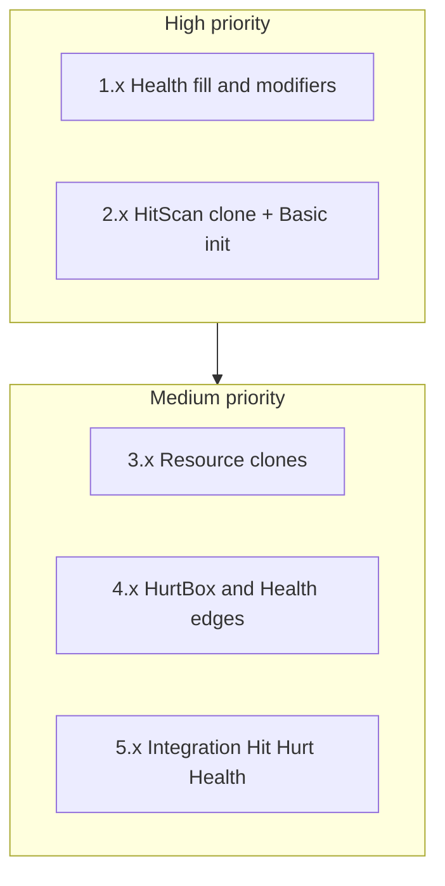
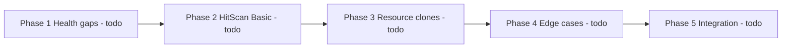
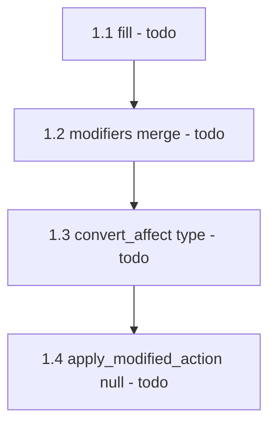
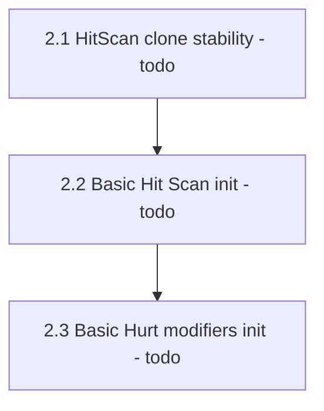
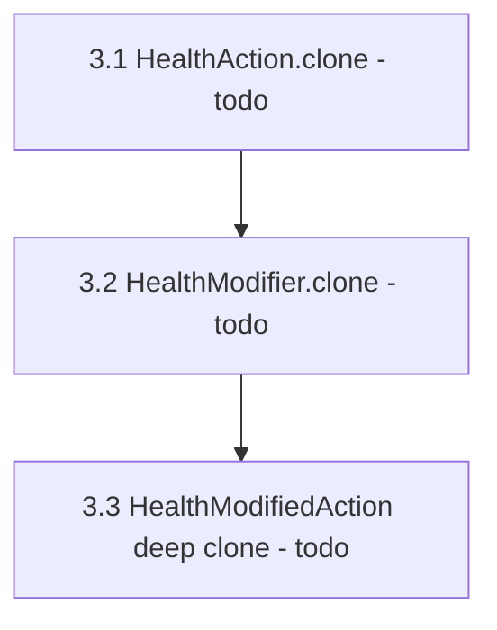
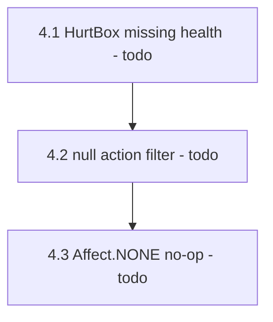

# Better testing coverage

Extend existing GdUnit4 suites under [`test/`](test/) using the same patterns (`GdUnitTestSuite`, `auto_free`, `mock`, `monitor_signals`, matchers in [`test/matchers/`](test/matchers/)). No production API changes unless a test reveals a real bug (then fix only what the test requires).

Status values: `todo` | `done`

## Progress overview

| Phase | Description | Status |
|-------|-------------|--------|
| 1 | Health gaps (`fill`, modifiers, null) | todo |
| 2 | HitScan clone + Basic init | todo |
| 3 | Resource clone suites | todo |
| 4 | HurtBox / Health edge cases | todo |
| 5 | Hit → Hurt → Health integration | todo |

Default scope: **high + medium** from the gap analysis. Out of scope: plugin registration, `@tool` HitScan editor `_set`, config-warning-only tests.

---

## Phase 1 — Health gaps

Extend [`test/health_test.gd`](test/health_test.gd).

| ID | Task | Status |
|----|------|--------|
| 1.1 | `fill()` from partial and from zero (revive path via heal) | todo |
| 1.2 | `Health.modifiers`: multiplier + incrementer merge on `apply_modified_action` | todo |
| 1.3 | `convert_affect` / `convert_type` on Health modifiers (e.g. DAMAGE→HEAL) | todo |
| 1.4 | `apply_modified_action(null)` no-ops without changing current | todo |

Reuse existing signal constants and `monitor_signals(health)` patterns already in the file.

---

## Phase 2 — HitScan clone + Basic init

| ID | Task | Files | Status |
|----|------|-------|--------|
| 2.1 | After `fire()` on HurtBox, assert HitScan `actions` array identity/contents unchanged (and that HurtBox received clones / separate instances) | [`test/hit_scan_2d_test.gd`](test/hit_scan_2d_test.gd), [`test/hit_scan_3d_test.gd`](test/hit_scan_3d_test.gd) | todo |
| 2.2 | Basic Hit/Scan: calling `_ready()` twice (or simulating re-entry) leaves a single action | all six `test/basic_*_test.gd` or one shared helper + 2D/3D spot checks | todo |
| 2.3 | Basic Hurt: modifiers dict has exactly KINETIC + MEDICINE after init; no duplicate keys on re-init | [`test/basic_hurt_box_2d_test.gd`](test/basic_hurt_box_2d_test.gd), [`test/basic_hurt_box_3d_test.gd`](test/basic_hurt_box_3d_test.gd) | todo |

Note: if 2.1 fails today, that confirms the HitScan-vs-HitBox clone inconsistency from the optimize plan — fix HitScan to clone like HitBox so the test documents correct behavior.

---

## Phase 3 — Resource clone suites

Add [`test/health_action_test.gd`](test/health_action_test.gd), [`test/health_modifier_test.gd`](test/health_modifier_test.gd), [`test/health_modified_action_test.gd`](test/health_modified_action_test.gd).

| ID | Task | Status |
|----|------|--------|
| 3.1 | `HealthAction.clone()` is equal but not same instance; mutating clone does not change original | todo |
| 3.2 | `HealthModifier.clone()` same guarantees | todo |
| 3.3 | `HealthModifiedAction.clone()` deep-clones nested action + modifier (fix shallow clone if test fails) | todo |

---

## Phase 4 — HurtBox / Health edge cases

| ID | Task | Files | Status |
|----|------|-------|--------|
| 4.1 | `apply_all_actions` with `health == null` does not call Health; assert `push_error` if GdUnit supports it, else assert no crash + current unchanged via spy | [`test/hurt_box_2d_test.gd`](test/hurt_box_2d_test.gd), 3D twin | todo |
| 4.2 | Null entries in actions array are filtered before `apply_all_modified_actions` | same | todo |
| 4.3 | `Health.apply_modified_action` with `Affect.NONE` leaves current unchanged | [`test/health_test.gd`](test/health_test.gd) | todo |

---

## Phase 5 — Integration

Add [`test/hit_hurt_health_integration_test.gd`](test/hit_hurt_health_integration_test.gd) (2D is enough for the first pass).

| ID | Task | Status |
|----|------|--------|
| 5.1 | Real `BasicHitBox2D` → `BasicHurtBox2D` → `Health` via `_on_area_entered`; assert health decreased and signals | todo |
| 5.2 | Real `BasicHitScan2D.fire()` → same HurtBox/Health path | todo |

Use [`test/scenes/test_character.tscn`](test/scenes/test_character.tscn) or assemble nodes in `before_test()` with `auto_free`.

---

## Success criteria

## Out of scope

| Item | Reason |
|------|--------|
| Plugin `add_custom_type` registration | Low value for unit tests |
| Editor-only HitScan `_set` / config warnings | Awkward in headless CI |
| Deduplicating mirrored 2D/3D suites | Follow-up, not required here |
