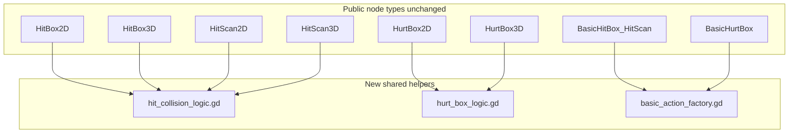
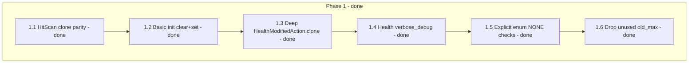
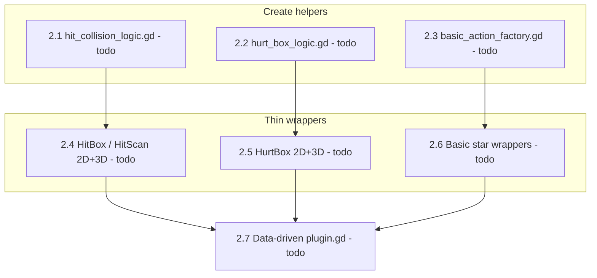
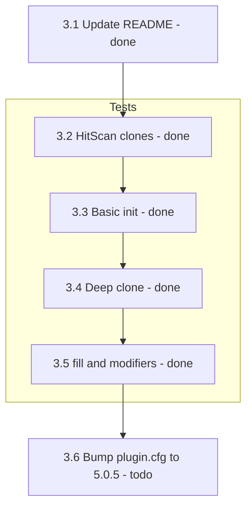
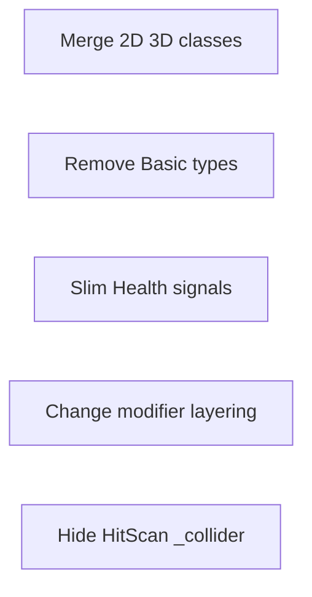
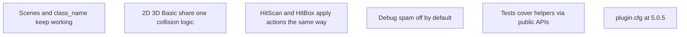

# Optimize and simplify (API-stable)

Constraint: **no breaking public API**. Keep existing `class_name`s, signals, exports, and method signatures. Deduplicate via shared static helpers and thinner wrappers; keep separate 2D/3D node scripts because Godot custom types must extend `Area2D`/`Area3D` / `RayCast2D`/`RayCast3D`.

**Status legend:** ✅ done · 🚧 in_progress · ⏳ todo

## Target architecture

## Progress overview

| Status | Phase | Description |
|--------|-------|-------------|
| ✅ | 1 | Correctness and small cleanups |
| ⏳ | 2 | Deduplicate shared logic |
| 🚧 | 3 | Docs, tests, version bump (README done; tests/version remain) |

---

## Phase 1 — Correctness and small cleanups (low risk)

| Status | ID | Task | Details |
|--------|----|------|---------|
| ✅ | 1.1 | HitScan clone parity | Clone actions before `apply_all_actions` in [`hit_scan_2d.gd`](addons/health_hitbox_hurtbox/2d/hit_scan_2d/hit_scan_2d.gd) and [`hit_scan_3d.gd`](addons/health_hitbox_hurtbox/3d/hit_scan_3d/hit_scan_3d.gd) (same as HitBox) |
| ✅ | 1.2 | Basic init clear+set | In all six `basic_*` scripts, replace `actions.append(...)` / assign-into-modifiers with clear + set so re-entry does not accumulate stale entries |
| ✅ | 1.3 | Deep `HealthModifiedAction.clone()` | In [`health_modified_action.gd`](addons/health_hitbox_hurtbox/resources/health_modified_action.gd), deep-clone `action` and `modifier` |
| ✅ | 1.4 | Health `verbose_debug` | Gate all `print_debug` in [`health.gd`](addons/health_hitbox_hurtbox/health/health.gd) behind `@export var verbose_debug: bool = false` |
| ✅ | 1.5 | Explicit enum NONE checks | Use `!= Health.Affect.NONE` / `!= HealthActionType.Enum.NONE` instead of truthiness on enums in convert paths |
| ✅ | 1.6 | Drop unused `old_max` | Remove unused `old_max` in `Health.max` setter if still present |

---

## Phase 2 — Deduplicate shared logic (main simplify win)

Introduce `addons/health_hitbox_hurtbox/shared/` with static helper scripts (no new custom types, no new public nodes).

Thin 2D/3D scripts keep `class_name`, `@export`s, signals, `@tool` / editor bits; call shared helpers with typed callables / local node refs.

| Status | ID | Task | Details |
|--------|----|------|---------|
| ⏳ | 2.1 | `hit_collision_logic.gd` | Area-entered / fire routing: ignore flag, HitBox vs HurtBox vs unknown, clone actions, emit via callables |
| ⏳ | 2.2 | `hurt_box_logic.gd` | Filter null actions, map to `HealthModifiedAction`, call `health.apply_all_modified_actions` |
| ⏳ | 2.3 | `basic_action_factory.gd` | `_type_from_affect`, build/sync single `HealthAction` for Basic Hit/Scan; build KINETIC/MEDICINE modifier dict for Basic Hurt |
| ⏳ | 2.4 | Thin HitBox / HitScan wrappers | Wire 2D+3D HitBox and HitScan scripts to `hit_collision_logic` |
| ⏳ | 2.5 | Thin HurtBox wrappers | Wire 2D+3D HurtBox scripts to `hurt_box_logic` |
| ⏳ | 2.6 | Thin Basic\* wrappers | Wire all six Basic scripts to `basic_action_factory` |
| ⏳ | 2.7 | Data-driven `plugin.gd` | Collapse [`plugin.gd`](addons/health_hitbox_hurtbox/plugin.gd) to a table of `{name, base, script, icon}` and one register/unregister loop |

---

## Phase 3 — Docs and tests (confidence, no API change)

Keep mirrored 2D/3D test suites; shared assertion helpers are optional and not required in the first pass.

| Status | ID | Task | Details |
|--------|----|------|---------|
| ✅ | 3.1 | Update README | Update [`addons/health_hitbox_hurtbox/README.md`](addons/health_hitbox_hurtbox/README.md) (and root README if duplicated) for **actions + modifiers** and Basic vs complex nodes |
| ✅ | 3.2 | Test HitScan clones | Assert actions array unchanged after fire |
| ✅ | 3.3 | Test Basic init | Assert init does not duplicate actions/modifiers |
| ✅ | 3.4 | Test deep clone | Assert `HealthModifiedAction.clone()` is deep |
| ✅ | 3.5 | Test fill + modifiers | Cover `fill()` and `Health.modifiers` / `convert_affect` gaps |
| ⏳ | 3.6 | Version bump | Bump [`plugin.cfg`](addons/health_hitbox_hurtbox/plugin.cfg) to `5.0.5` |

---

## Explicitly out of scope

| Item | Reason |
|------|--------|
| Merging 2D/3D into single classes or removing Basic\* types | Breaking / over-scope |
| Slimming Health’s signal surface | Breaking |
| Changing HurtBox vs Health dual-modifier layering | Behavior change |
| Hiding HitScan `_collider` test seam | Needs test refactor |

---

## Success criteria

