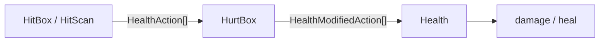

# Godot  Health,  HitBoxes,  HurtBoxes, and  HitScans

Composable 2D/3D components for health, damage, and healing in Godot 4.4+.

> [!CAUTION]
> v5 renamed the simple nodes to `Basic*` and added advanced variants with typed actions and modifiers.
> Upgrade to v4.4.0 first if migrating from older versions, then to v5.

## Documentation

See the [Wiki](https://github.com/cluttered-code/godot-health-hitbox-hurtbox/wiki) for tutorials and deeper detail.

## Overview

| Role | Basic (simple) | Advanced |
|------|----------------|----------|
| Attack (area) | `BasicHitBox2D` / `3D` — `affect` + `amount` | `HitBox2D` / `3D` — `actions: Array[HealthAction]` |
| Attack (ray) | `BasicHitScan2D` / `3D` — `affect` + `amount` | `HitScan2D` / `3D` — `actions`; call `fire()` |
| Defense | `BasicHurtBox2D` / `3D` — damage/heal multipliers | `HurtBox2D` / `3D` — `modifiers` by action type |
| State | `Health` — current/max, conditions, optional `modifiers` | same |

**Pipeline:** HitBox/HitScan send `HealthAction` values → HurtBox wraps them with its `modifiers` → Health merges its own `modifiers` and applies damage or heal.

Core resources: `HealthAction` (`affect`, `type`, `amount`), `HealthModifier` (`incrementer`, `multiplier`, convert fields), `HealthActionType` (`KINETIC`, `MEDICINE`, …).

## Health

Tracks an entity’s health and emits signals for damage, healing, death, revival, and related edge cases (`damageable`, `healable`, `killable`, `revivable`).

## HurtBox

`HurtBox2D` / `HurtBox3D` need a collision shape and a linked `Health`. Prefer `BasicHurtBox*` when you only need damage/heal multipliers (or invert damage↔heal). Use the base HurtBox when you need per-type `modifiers`.

## HitBox

`HitBox2D` / `HitBox3D` detect HurtBoxes on collision. Prefer `BasicHitBox*` for a single damage/heal amount. Use the base HitBox to send multiple typed `HealthAction`s. Set `ignore_collisions` to stop further hits (e.g. before `queue_free()`).

## HitScan

`HitScan2D` / `HitScan3D` extend `RayCast2D` / `RayCast3D`. Prefer `BasicHitScan*` for a single affect/amount. Call `fire()` to apply the hit. Enable colliding with areas (forced in the editor).

## Live example

[itch.io — godot-health-hitbox-hurtbox-hitscan](https://cluttered-code.itch.io/godot-health-hitbox-hurtbox-hitscan)

## Installation

1. Open the **AssetLib** tab in the Godot Editor.
2. Search for `Health`, `HitBox`, or `HurtBox`.
3. Download **Health, HitBoxes, HurtBoxes, and HitScans**.
4. Enable it under **Project → Project Settings → Plugins**.

## Usage

1. Add a `Health` node to the entity (`CharacterBody2D`, `CharacterBody3D`, etc.).
2. Add a `BasicHurtBox2D` (or `3D`) with a collision shape; assign `Health` and set its collision **layer**.
3. For melee/projectiles: add `BasicHitBox2D` (or `3D`), set `affect` / `amount`, and match the HurtBox **mask** to that layer. Collisions apply automatically.
4. For hitscan weapons: add `BasicHitScan2D` (or `3D`), set the mask the same way, and call `fire()` when shooting.

For multiple damage types or custom resists, use the non-Basic HitBox/HitScan/HurtBox nodes and configure `actions` / `modifiers`.

## Issues

Submit issues on the [GitHub Issues page](https://github.com/cluttered-code/godot-health-hitbox-hurtbox/issues).
